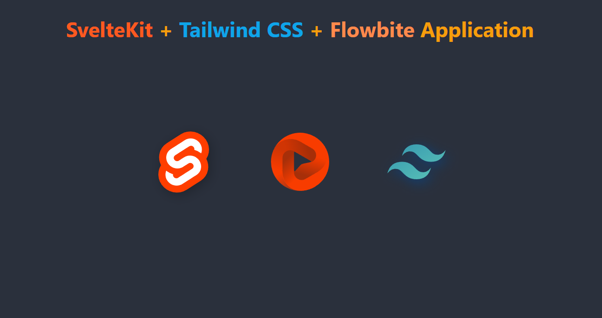

# <span style="color:#fc3508;"> SvelteKit </span> + <span style="color:#0062eb"> Tailwind CSS </span> + FlowBite

<p> Simple Template </p>

# Movie Booking App

Install Application :
Change : <code>folder-name</code>

```
    git clone https://github.com/PriyaPal001/Skit-Tcss-Flowbite.git folder-name

```

Install Plugins :

```bash
    npm i
```

## Run Application

```bash
    npm run dev -- --open

```

#### Application will open at

<a href="localhost:5173" >localhost:5173</a>
